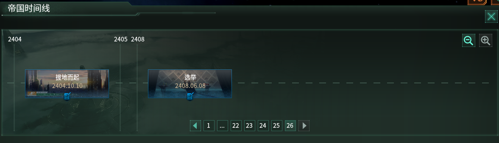
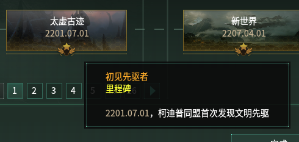

# Stellaris Empire Chronicle Generator (群星帝国编年史生成器)

<p align="center">
	<a href="#zh">简体中文</a> | <a href="#en">English</a>
</p>

## 简体中文

<a id="zh"></a>
<p align="right">[切换到 English](#en)</p>



**图：游戏内“帝国时间线”界面示例** — 本脚本解析的就是此界面背后的 `gamestate` 事件数据，生成按时间顺序排列的编年史。

一份用于解析《群星》(Stellaris) 游戏存档、并为您的玩家帝国生成一部宏大编年史的Python脚本。将您的游戏历程转化为史诗故事，与AI分享，创作属于您自己的银河传奇。

> **语言支持说明**: 目前，本项目生成的编年史及相关文件内容均为 **简体中文**。我们计划在未来添加对更多语言的支持，同时也非常欢迎社区用户 Fork 本项目并贡献其他语言的版本。

### 📖 源起 (Origin)

好不容易走了宇宙创生线一把，想拿去给Gemini写一个帝国史诗，结果找了一个晚上根本找不到提取时间线的代码，遂自己动手。

### ✨ 功能 (Features)

- **存档解析**：深度解析《群星》存档中的 `gamestate` 文件，精确提取与玩家帝国相关的每一个时间线事件。
- **编年史生成**：将解析出的事件按时间顺序排列，自动生成一份清晰、可读的帝国编年史 `.txt` 文件。
- **动态帝国塑造**：为了增加故事的沉浸感，脚本会根据游戏中发生的事件（如战争、外交）动态地、随机地生成遭遇的AI帝国、堕落帝国等实体的详细设定，包括种族、思潮、政体等。
- **AI设定导出**：将所有动态生成的AI帝国信息汇总成一个独立的 `.md` 文件，方便您了解这些“邻居”的背景故事，也为AI创作提供了丰富的素材。
- **统计报告**：生成一份统计文件，包含已识别和未识别的事件代码，方便后续的开发和完善。

### 🚀 使用方式 (How to Use)

#### 1. 准备工作：提取存档文件

您需要从《群星》的存档中提取出核心的游戏状态文件。

1. **定位存档文件夹**：通常位于您的“文档”目录下： `C:\Users\[您的用户名]\Documents\Paradox Interactive\Stellaris\save games\` 在文件夹中找到您想要的存档，它会是一个 `.sav` 文件。
2. **解压存档**：将存档文件（例如 `my_empire.sav`）的后缀名从 `.sav` 修改为 `.zip`。
3. **提取文件**：解压这个 `.zip` 文件，您会得到一个名为 `gamestate` 的文件。
4. **放置文件**：将 `gamestate` 文件与本项目的 `stellaris_chronicle_generator_v0.02.py` 脚本放在同一个文件夹下。

#### 2. 环境配置

本项目使用Python开发，无需安装任何第三方库。

1. **安装 Python**: 如果您的电脑没有安装Python，请前往 [Python官方网站](https://www.python.org/downloads/) 下载并安装最新版本的 Python 3。在安装时，请务必勾选 `Add Python to PATH` 选项。
2. **验证安装**: 打开命令行工具（如CMD或PowerShell），输入 `python --version` 并按回车。如果显示出版本号，则说明安装成功。

#### 3. 运行脚本

准备好后，通过命令行工具进入脚本所在的文件夹，然后根据您的需要选择以下一种方式运行。

##### 方式一：交互式运行

在命令行中输入以下指令，程序会提示您输入帝国名称。

```
python stellaris_chronicle_generator_v0.02.py gamestate.txt
```

程序会提示： `请输入您的帝国名称（直接按回车使用默认名称'玩家帝国'）:` 输入您帝国的名字后按回车即可。如果直接按回车，则使用默认名称。

##### 方式二：通过命令行参数运行

如果您希望直接指定帝国名称，可以在命令中加入第二个参数。请注意，如果您的帝国名称包含空格，请用英文双引号 `""` 将其括起来。

```
# 示例 1: 简单名称
python stellaris_chronicle_generator_v0.02.py gamestate.txt 泰拉联邦

# 示例 2: 带空格的名称
python stellaris_chronicle_generator_v0.02.py gamestate.txt "地球联合政府"
```



**图：事件卡片描述示例** — 该截图展示了时间线中事件卡片的弹出描述，便于贡献者和使用者理解编年史中每条记录对应的游戏内事件含义。

### 📜 输出结果 (Output)

脚本成功运行后，会在当前文件夹下生成三个文件：

1. **`群星帝国编年史.txt`**: 您的帝国编年史主文件。
2. **`动态生成实体设定.md`**: 记录了所有随机生成的AI帝国信息的详细设定集。
3. **`生成统计.txt`**: 本次运行的统计数据，主要用于调试和开发。

### ⚠️ 目前的缺陷 (Current Limitations)

- **事件代码不全**：许多事件仍会显示为“未收录事件”。
- **名称占位符**：游戏内的星球、星系、殖民地和领袖的名称目前还是占位符。
- **AI帝国随机生成**：遭遇的AI帝国是随机生成的，与您在游戏中实际遇到的帝国并不完全一致。
- **潜在Bug**：代码中可能还存在一些未被发现的解析错误或逻辑Bug。

### 📅 更新计划 (Future Plans)

- [ ] **补全事件代码**：持续收集并补充更多的事件代码及其描述。
- [ ] **实装真实名称**：开发解析功能，读取并替换真实的名称。
- [ ] **手动输入功能**：增加允许用户手动输入或修改AI帝国、星球等设定的功能。

---

### 🔎 提交事件/描述补充的 Issue 格式（贡献指南）

如果你希望为事件代码、事件标题或描述提供补充，请在 GitHub Issue 中按以下格式提交：

```
代码内容：<代码简称>_<事件标题>_<事件类型>_<详细描述>

例如："timeline_first_precursor": "太虚古迹_初见先驱者_里程碑_[玩家帝国]首次发现文明先驱"
```

请在提交时尽量附上相关截图或存档片段（如能给出 `gamestate` 中的原始事件行将更有帮助）。我们会审核后将其加入到事件库中。

### 📜 开源声明（使用与著作权）

- 本脚本免费提供给玩家个人使用与学习，欢迎 Fork 并参与迭代开发。
- 禁止将本脚本用于以牟利为目的的商业使用（包括但不限于直接销售或收费提供相关服务）。
- 本代码之著作权归作者个人所有。若需商业使用或其它特别授权，请联系作者并获得书面许可。

如果你喜欢这个项目，欢迎给我们一个 Star ⭐，这将极大鼓励我继续维护与改进。


## English

<a id="en"></a>
<p align="right">[Switch to 简体中文](#zh)</p>

A Python script designed to parse *Stellaris* save files and generate a grand chronicle for your player empire. Transform your gameplay into an epic saga, share it with AI, and create your own galactic legend.


Figure: In-game "Empire Timeline" interface — this project parses the `gamestate` events behind this view and generates a chronological chronicle.

> **Language Support Note**: Currently, this project generates all chronicles and related files in **Simplified Chinese** only. Support for more languages is planned for future updates. We warmly welcome community forks and contributions for other language versions.

---

### 🔎 Issue submission format for event/description additions (Contribution Guide)

If you'd like to contribute additional event codes, titles, or descriptions, please open a GitHub Issue using the format below:

```
CodeContent:<short_code>_<Event Title>_<Event Type>_<Detailed Description>

Example (key/value style): "timeline_first_precursor": "太虚古迹_初见先驱者_里程碑_[玩家帝国]首次发现文明先驱"

Example (natural): ElectricFlesh_FirstRobot_Milestone_2204.03.12, first completed large-scale autonomous robot project, triggered social structure changes.
```

Field guide:
- **CodeContent / short_code**: A short identifier for quick recognition (e.g. `ElectricFlesh`).
- **Event Title**: A concise title (e.g. `FirstRobot`).
- **Event Type**: e.g. `Milestone`, `War`, `Diplomacy`, `Tech`, etc.
- **Detailed Description**: Provide the date, effects and contextual notes to help us map the entry to the `gamestate` event.

Please attach screenshots or savefile snippets when possible (providing the original `gamestate` event line is most helpful). We will review and add accepted contributions to the event library.

### 📜 Open-source statement (Usage & Copyright)

- This script is provided free of charge for players' personal use and learning. Forks and collaborative development are welcome.
- Commercial use for profit (including but not limited to selling the script or charging for related services) is prohibited without explicit written permission.
- Copyright of this code belongs to the original author. For commercial or special licensing requests, please contact the author.

If you enjoy this project, please give it a Star ⭐ on GitHub — it really helps and encourages further maintenance and improvements.

### 📖 Origin

After a thrilling playthrough with the "Cosmic Progenitor" , I wanted to document this unique experience and hand it over to an AI (like Gemini) to write a custom empire epic. However, after a thorough search, I found no existing tools that could conveniently extract the empire's timeline from a save file. So, I decided to build it myself.

### ✨ Features

- **Save File Parsing**: Deeply parses the `gamestate` file from *Stellaris* saves to accurately extract every timeline event related to the player's empire.
- **Chronicle Generation**: Arranges the extracted events chronologically and automatically generates a clean, readable `.txt` file of the empire's chronicle.
- **Dynamic Empire Forging**: To enhance immersion, the script dynamically and randomly generates detailed profiles for encountered AI empires, Fallen Empires, etc., based on in-game events like wars and diplomacy. These profiles include species, ethics, authority, and more.
- **AI Profile Export**: Compiles all dynamically generated AI empire information into a separate `.md` file, providing rich background material for AI-assisted storytelling.
- **Statistical Report**: Creates a statistics file listing both recognized and unrecognized event codes, facilitating future development and contributions.

### 🚀 How to Use

#### 1. Preparation: Extract the Save File

First, you need to extract the core game state file from your *Stellaris* save.

1. **Locate Save Folder**: Navigate to your save games folder, typically found at: `C:\Users\[YourUsername]\Documents\Paradox Interactive\Stellaris\save games\` Find the desired `.sav` file within this folder.
2. **Decompress Save**: Change the file extension from `.sav` to `.zip` (e.g., `my_empire.sav` -> `my_empire.zip`).
3. **Extract File**: Unzip the file. You will find a file named `gamestate` inside.
4. **Place File**: Move the `gamestate` file into the same directory as the `stellaris_chronicle_generator_v0.02.py` script.

#### 2. Environment Setup

This project is built with standard Python and requires no external libraries.

1. **Install Python**: If you don't have Python, download and install the latest Python 3 version from the [official Python website](https://www.python.org/downloads/). Ensure you check the box `Add Python to PATH` during installation.
2. **Verify Installation**: Open a command-line tool (like CMD or PowerShell) and type `python --version`. If it displays a version number, you're all set.

#### 3. Running the Script

Open a command line in the script's directory and run it in one of the following ways.

##### Mode 1: Interactive Mode

Run the script with the gamestate file as an argument. It will then prompt you for your empire's name.

```
python stellaris_chronicle_generator_v0.02.py gamestate.txt
```

The program will ask: `Please enter your empire name (press Enter to use the default 'Player Empire'):` Type your empire's name and press Enter.


Figure: Example event card description — this screenshot shows the popup that appears for timeline event cards, helping contributors and users map chronicle entries to in-game events.
